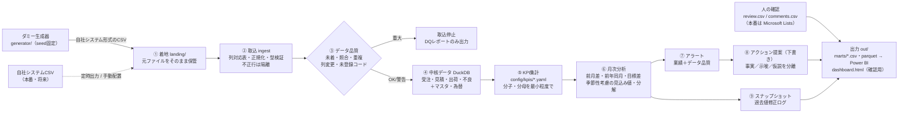

# 月次KPI管理（kpi-monthly）

自社システムのCSVを取り込み、月次KPIの集計・前月からの変化の分析・アラート・アクション提案までを行い、
Power BI（または DOMO）と確認用HTMLダッシュボードに出力する仕組みです。

> **現在はダミーデータで検証中です。** KPI定義・列名・組織・顧客・目標・アラート閾値はすべて**仮**で、
> 会社の実際の定義ではありません。本番用の設定（`config/*/prod`）は、承認されるまで実行できないようにしています。

## データの流れ



## まず動かす

Python 3.11 以上。

```bash
pip install -r requirements.txt

# 1) ダミーデータを作る（シナリオ S0 = 通常推移。all で全シナリオ）
python -m generator.generate --scenario S0 --out data/dummy

# 2) 月次パイプラインを実行（対象月 2026-08、取込日 2026-09-08）
PYTHONPATH=src python -m kpimonthly.pipeline \
  --landing data/dummy/S0/landing/batch_01 --target-month 2026-08 --as-of 2026-09-08 --out out/S0

# 3) out/S0/dashboard.html をブラウザで開く。Power BI は out/S0/marts/ をフォルダ接続で読み込む

# デモ（納期遅延・粗利率低下・大口案件などを同時に含む月）
./scripts/run_demo.sh

# 検証シナリオ（S0〜S18）を全件実行して照合
PYTHONPATH=src:. python -m kpimonthly.verify --scenario all
python -m pytest -m "not slow"   # 単体テスト（1秒未満）
python -m pytest -m slow         # 全シナリオ＋再現性（約10分）
```

## 構成

```
config/
  kpis/*.yaml                KPI定義（1KPI＝1ファイル。追加はファイルを置くだけ）
  sources/{dummy,prod}/      自社システムCSVの列 → 標準列 の対応表、到着期限
  thresholds/{dummy,prod}/   アラート閾値（dummy は仮、prod は承認必須）
  analysis.yaml              分析する内訳（法人・商品・事業部・チーム・課・業種・規模・顧客）
  actions/templates.yaml     アクション提案の仮説・確認事項のテンプレート
  review/dummy/              人の確認結果（アラートの確認状況・担当・期限）と月次コメントのサンプル
  profiles/{dummy,prod}.yaml 上記の組み合わせ
generator/                   ダミーデータ生成器・正解値計算・検証シナリオ（scenarios/*.yaml）
src/kpimonthly/              取込・DQ・集計・分析・アラート・アクション・出力・ダッシュボード
tests/                       単体テスト・シナリオテスト
docs/                        設計（design.md）・検証結果（scenarios.md）・実データ移行（migration.md）
```

## 出力（out/<実行>/）

| ファイル | 内容 | 主な利用先 |
|---|---|---|
| `marts/kpi_monthly.*` | KPI × 内訳 × 月：当月値・前月差・前年同月・目標差・見込み値・乖離・データ状態 | Power BI の中心テーブル |
| `marts/kpi_fact_fine.parquet` | 最小粒度の分子・分母（任意の絞り込みで再集計できる） | Power BI の明細 |
| `marts/alerts.csv` | 業績アラート（優先度・根拠・データから言える示唆） | アラート一覧・Lists への取込 |
| `marts/actions.csv / .json` | アクション提案の下書き（事実・示唆・仮説・確認事項・影響・担当・期限） | Lists への取込 |
| `marts/dq_issues.csv` ほか | データ品質の検知事項、隔離行、到着ログ、過去値の修正ログ | データ管理者 |
| `marts/dim_*.csv`, `kpi_definitions.csv` | マスタ・KPI定義 | Power BI のディメンション |
| `dashboard.html` | 確認用ダッシュボード（データ埋め込みの単一ファイル） | 画面構成の検証・配布 |
| `manifest.json` | 実行ID・取込日・設定の版・閾値の状態・件数 | 監査 |

## KPIを追加する

1. `config/kpis/<id>.yaml` を作る（例：`generator/scenarios/extra/avg_order_value.yaml`）。
   分子・分母は既存のビュー（`v_order_lines` / `v_quotes` / `v_due_lines` / `v_shipped_lines`）に対するSQL式で書く。
2. 閾値を `config/thresholds/*/thresholds.yaml` に追加する。**閾値がないKPIは表示のみで、アラートは出ない。**
3. 新しい元データが必要な場合だけ、`config/sources` の列対応と `core.py` のビューを追加する。

シナリオ S17 で、設定ファイルの追加だけでKPIが集計・表示されることを確認しています。

## 詳しく

- 設計の考え方と判断基準：[docs/design.md](docs/design.md)
- 検証シナリオの入力・期待結果・実際の結果：[docs/scenarios.md](docs/scenarios.md)
- 実データへの移行手順と、用意していただく情報：[docs/migration.md](docs/migration.md)
